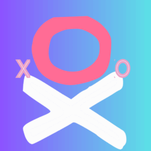
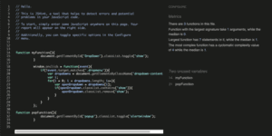

 

# Tic Tac Toe Game

## Introductions

Welcome to my second project. The project is to showcase what I have learned so far with **HTML** , **CSS** and **JavaScript** programming languages. Is to apply everything learned into pratical live project. For this project I chose to create a **Tic Tac Toe** game. Something so simple and yet many enyoy playing, to distress! The logo above I wanted it to represent all the color combination of the website. And as the game is about **X** and **O**, I thought it would be fitting to create the logo that best represents the game. I saw it fit to display JavaScript functions I have learned so far using this game. I wanted to create something fun and enjoyable for a distressor, while applying my skills

[Github][def]

## Table of Content
1. [Site Owner Goal](#site-owner-goal)
2. [User Experience](#user-experience)  
3. [User Story](#user-story)
4. [Color Scheme Used](#color-scheme-used)
5. [Typography](#typography)
6. [Wireframe](#wireframe)
    1. [Landing Page](#landing-page)
    2. [About Page](#about-page)
    3. [Game Page](#game-page)
    4. [Contact Page](#contact-page)
6. [Features](#features)
    1. [Landing Page](#landing-page)
    2. [About Page](#about-page)
    3. [Game Page](#game-page)
    4. [Contact Page](#contact-page)
7. [Technologies](#technologies)
    1. [Code Languages](#code-languages)
    2. [Frameworks Used](#frmaework-used)
    3. [Extra Support](#extra-support)
    4. [Technologies used for testing](#technologies-used-for-testing)
8. [Testing](#testing)
    1. [Debugging](#debugging)
13. [Code Validation](#code-validation)
14. [Acknowledgement](#acknowledgement)

## Site Owner Goal 

* The purpose of the game is to have fun. 
* To educate the user about the origin of the game.
* And provide strategies on how to win.
* For the user to choose to play with a the computer or to play with a friend, depending on personal preference. 
* Giving the user the choice to decide who to play with.

## User Experience  

* For the user to learn about the historic origin of the game.
* For user to have fun playing the game. 
* For the user to have access to giving feedback.
* For user to have throu understanding of the game instruction and rules.
* For user to learn strategies on how to win the game.
* For user to easily naviigate through the game. 

## User Story 
* I want to easy navigate through the game website.
* I want the layout to be intiutive to understand on first attempt.
* I want to go on a journey of learnig about the game before playing it.
* I want tips or trategies on how to win the game.
* I want a clear discription about the game instructions on how to play it.
* I want to enjoy playing the game.
* I want options to choose who to play with.
* I want to give feedback or ask questions.
* I want social media platform to connect and follow, to know of any upcoming event regarding the game.
* I want to look at an interactive website. 
* I want to be engaged while playing the game.
 

[Table of Content](#table-of-content):arrow_up:  

## Color Scheme Used 

I choose to go for the fun neon like colors. To make the site fun and to go with the logo. 
 

* __#F53A91FF__ __Deep Pink:__ - It is used to highlight and emphasise buttons and menu bar.
* __#7947D6FF__ __Majorelle Blue:__ - It is used togethor with **Deep Pink** for menu and buttons.
* __#6F00FFFF__ __Electric Indigo:__ - It is on the game background board and to create shadow effect.
* __#04D9fAFF__ __Vivid Sky Blue:__ - It is used as an interactive background animation and pop up windows. 
* __#F3EAF3FF__ __Magnolia:__ - It is use on the form and the about page for a clean redable bacground.
* __#131313FF__ __Night:__ - It is used for the font and creating shadow on background and buttons.

## Typography
I choose to used **Google Fonts** **Caveat** paired with **Kalam**  and **Cursive**, used as a fall back. 

## Wireframe 
There are four platform created for the game. First, it is the landing page with menu options leading **About**, **Game** and **Contact**. Choose not to include the landing page on this menu, as the user would already be on. However other pages with the menu bar, there is an option for the landing page.
 

### Landing Page
* It has icon and name of the game.
* Button link to about page.
* Button link to game page. 
    * Opens a pop up window to give the player an option to choose play with computer or alone.
    * Name edit input.
    * Submit button leading to the game page.  
* Button link to contact page.

### About Page
* Logo image with title.
* A drop down menu.
* Three paragraphs detaling:-
    * Origin of the game.
    * Trategies of playing the game.
    * Tips on how to win the game 

### Game Page
* Logo image with title.
* Home page button and exit button - this was later changed to a link leading about page as the help icon and the exit button leading to home page.  
* Nine tiles to play.
* Reset button to restart the game. 
* life count and timer for difficult level - because of time contrains this were not implemented.

### Contact Page
* Logo image with game title.
* A drop down menu with the links to all pages.
* A form to give feedback or contact.
    * On submssion a pop up window with a "Thank you note".

 

### Tablet and Desktop View
The game is built from mobile up. I have created a responsive breaking points on **600px** and **1080px**. The content is the same with few changes as per viewport size on certain pages than others. 
* __Home Page__ - It is the same across all viewport with only changes made as per responsive viewport size.
* __About Page__ - On mobile content is on one row droping down to overflow. On **600px** going up content is in two rows.
* __Game Page__ - Is the same across all viewports with breaking points to fit each difference. 
* __Contact Page__ - the mobile has a dropdown menu and **600px** going up has an inline menu bar.

 

[Table of Content](#table-of-content):arrow_up: 

## Features 
The website consist of the following features. 

### Home Page

### About Page
 

### Game Page

### Contant Page
* There is a logo on the top center of the page. Both **About Page** and **Contact Page** have the same heading. 
* For viewport below **480px** there is a drop down menu on the right coner.
* The website game name is on the left, inline with the menu. 
* There is a form for feedback. 
* On submission there is a pop up window with "Thank you message".

 

* There drop down menu changes color on hover.
* The menu drops on focus.
* Each menu option lead to a page in the website.

 

* For viewport of **770px** and above, there is a inline menu.
* Each menu button changes color on hover.
* Each button lead to it's respective link in the website.

 

* On form submission there is a pop up message. 
* The message fade away in 10sec.

 

[Table of Content](#table-of-content):arrow_up: 

### Technologies

#### __Languages Used__
* __HTML__
* __CSS__
* __JavaScript__

#### __Frameworks Used__
* [Google Fonts](https://fonts.google.com/) - used one of thier fonts as a choice of fonts.
* [Font Awesome](https://fontawesome.com/) - used to ad social media icons.
* [Balsamiq](https://balsamiq.com/) - used to create the wireframe.
* [Git Pages](https://pages.github.com/) - used to deploy the game pages. 
* [GitHub](https://github.com/Cy-2-30/PP2_XO_game) - used for the repository and progress across the project.  
* [GotPod](https://gitpod.io/workspaces) - used the platform to build the project.

#### __Extra Support__
* Code
    * [w3schools](https:https://www.w3schools.com/)
    * [Code Pen](https://codepen.io//)
    * [Stack Overflow](https://stackoverflow.com/) 
    * [W3](https://www.w3.org/)
    * [Hobo Web](https://www.hobo-web.co.uk/)
    * [Geeks For Geeks](https://www.geeksforgeeks.org/)
    * [CSS Tricks](https://css-tricks.com/)
    * [Mdn](https://developer.mozilla.org/)
* Code Game Sample
    * [JavaScript Academy](https://youtu.be/B3pmT7Cpi24)
    * [Coding Artist](https://youtu.be/al_AgC2NSCo) 
    * [Coding With Siphiwo](https://www.youtube.com/watch?v=oZrp3Atkz18) 
    * [Bro Code](https://www.youtube.com/watch?v=AnmwHjpEhtA) 

### Technologies used for testing
* [Resposive Design Checker](https://ui.dev/)  - Checking Responsiveness
* [W3C Markup Validator](https://validator.w3.org/) - Checking HTML file.
* [W3C CSS Validator](https://jigsaw.w3.org/css-validator/) - Checking CSS file.
* [Chrome DevTools](https://developer.chrome.com/docs/devtools/) - Testing code, responsiveness and debugging as I build.
* [CodePen](https://codepen.io//) - Putting different code snippents and trying them out.
* [jshint](https://jshint.com/) - Checking JavaScript code.

[Table of Content](#table-of-content):arrow_up: 

## Testing 

### Debugging Resolutions
Because of time contrains I did not have enough time to fix all the bugs. Will be fixed on future release. Some of the features could not be impleted and would be implemented on the next release. 

| Bugs                                  | Resolved|  Resolution                 |
| ---   | --- | --- |
| The log image margin not the same         | No   |    |
| ---   | --- | --- |
| Submission pop up - pop up as you fill the form           | No |  |
| ---   | --- | --- |
| Drop down menu not responsive on click        | No |  |
| ---   | --- | --- |
| Content (first paragraph including image) from 770px on about me page is not showing   | Added **br** tag but only fixed 1200px |  |
| ---   | --- | --- |
| The menu bar could be styled and logo not responsive to selectors styling   | Yes | Had to coment out the css style file and rebuild everyting |
| ---   | --- | --- |
| GitHub Pages could not enforce the https to open the page   | Still in progress | Contacted **Student Support** and they could not help but referred me to contact **GitHub**  Had to contact [NameCheap](https://ap.www.namecheap.com/) support to request for help(Not Resolve). I had to contact [GitHub Support](https://support.github.com/) but still waiting for response.  |
| The form was flickering on the click of submission button   | Yes | Removed the action link |
| ---   | --- | --- |
| There is a big gap next to the paragraph image on about page from 1280px, on hover the gap appears and the image is not displayed  | No |  |
| ---   | --- | --- |
| The content on the about page overflows the background container   | No |  |
| ---   | --- | --- |
| Menu Buttons on home page are not showing on the center but from the start. When the view port is big it leaves a big space open  | No |  |
| ---   | --- | --- |

| Social media icons all move on hover   | No |  |
| ---   | --- | --- |
|  Menu on about page and contact are now showing as a block compared to inline row  | No |  |
| ---   | --- | --- |
| The names of players are not linked to the commment of player's turns and when it is a players turn the correct name do mot come up.  | No |  |
| ---   | --- | --- |

[Table of Content](#table-of-content):arrow_up: 

#### Not implemented
* There supposed to be multiple icons on the landing page but only added 4 icons.
* On the game page there was meant to be life and time counter but could not be implemented

#### Extra features
* There are images added on the about page and not in the initial wireframe.

#### Changed implementations 
* The logo was supposed to be alligned with the image logo but changed it to be on top of the menu bar. 
* on the game buttons there was supposed to be exit link button and home button link. Because both were leading to the same page, home button was changed to info icon link leading to about page.  

## Code Validation

### About Page  
* The ul heading was giving an error and I had to cover it in **h2**

* After resolving the issue, the problem was resolved.

### Contact Page 

* Some of the tags were not closed. 
* The section tag had to heading. 

* I closed all tags  
* Changed the section element into a div

* I could not pick up the external JavaScript file and I was getting an error of "function not declared". 

* I moved the JavaScript file internally and the error was resolved. The code passed. 

## Acknowledgement
* A big thank you to my mentor Marcel who helped with some of the styling and funtionality. 
* **Youtube** javaScript tutorials.  

[def]: https: